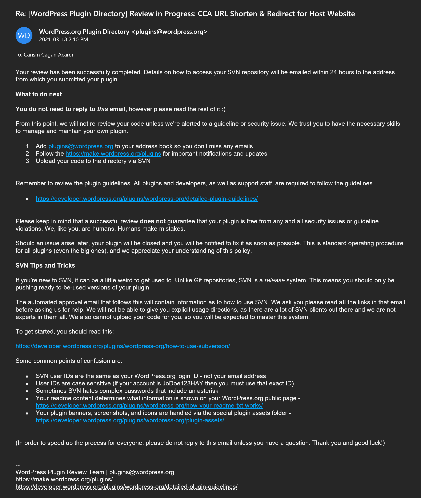
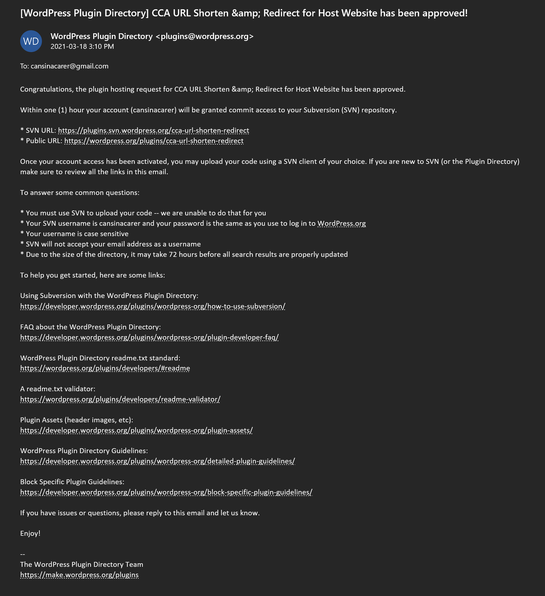
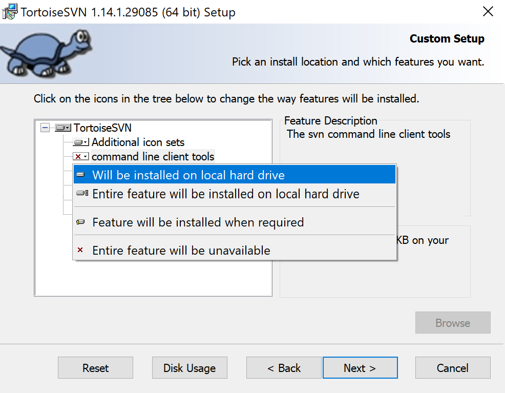
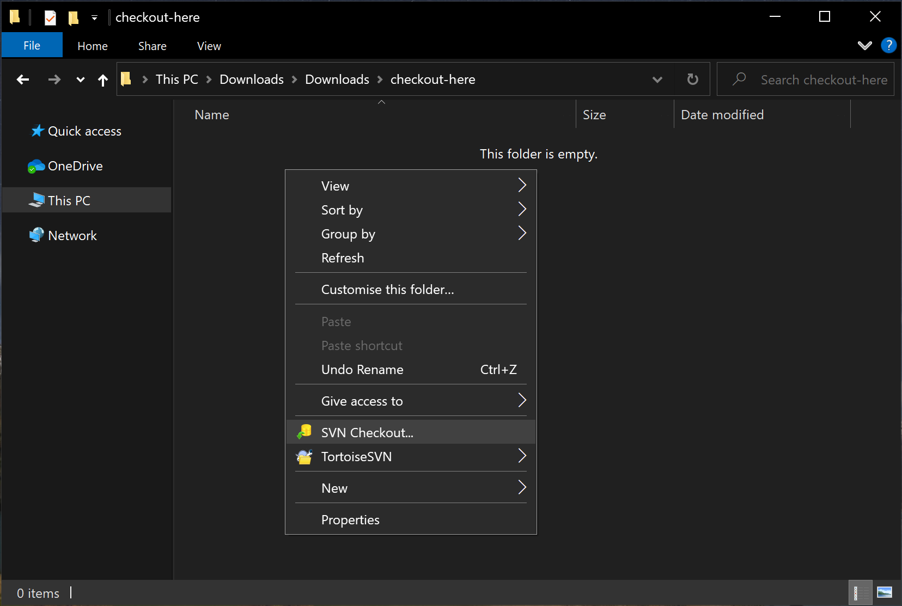
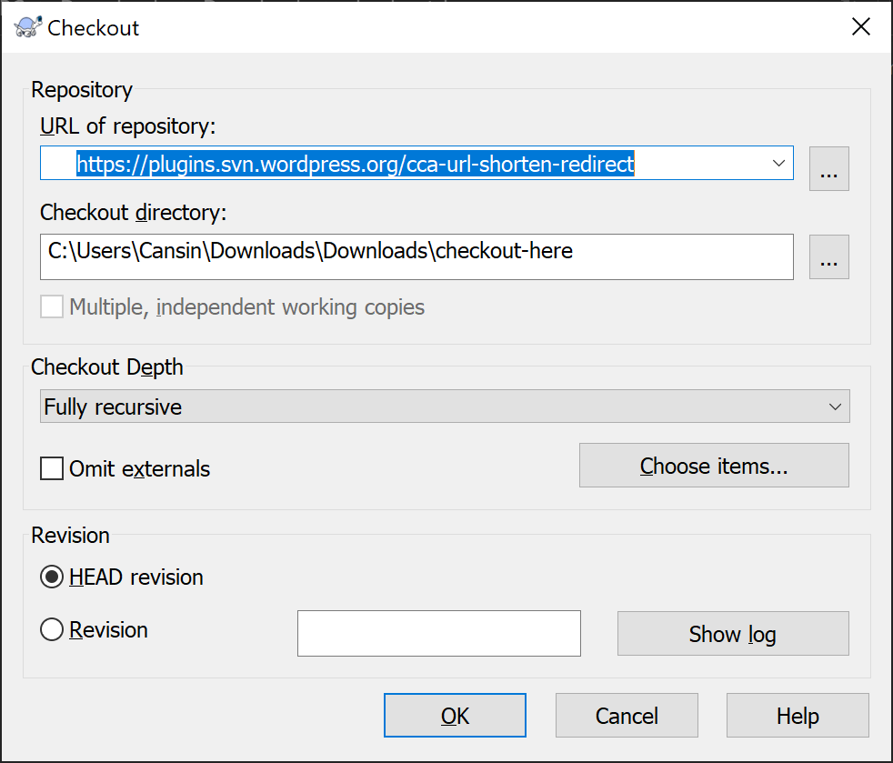
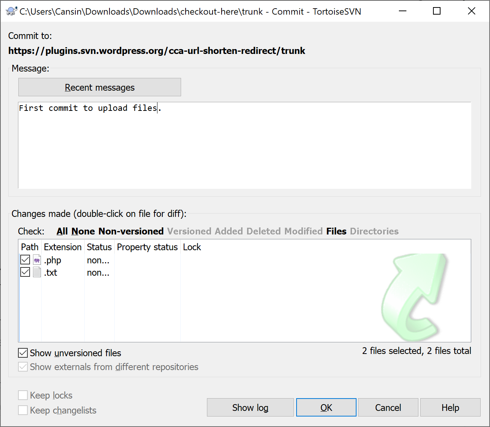

If you want to publish your plugins on the the WordPress Plugin Directory, you will need to use SVN ([Apache Subversion](https://subversion.apache.org/)) version control system to upload your code. Unlike Git, Wordpress SVN is a release system; therefore, Wordpress wants the developers to only upload ready-to-be-used versions of your plugin. You should keep your code in development separate from Wordpress SVN.

This article will cover:

- [Plugin Submission Process](#plugin-submission-process)
- [Installing TortoiseSVN](#installing-tortoisesvn)
- [Uploading Your Plugin to WordPress SVN for the First Time](#uploading-your-plugin-to-wordpress-svn-for-the-first-time)
- [Editing Your Plugin Web Page on WordPress.org](#editing-your-plugin-web-page-on-wordpressorg)
  - [Icon, Banner, and Screenshots](#icon-banner-and-screenshots)
- [Releasing Updates for Your Plugin](#releasing-updates-for-your-plugin)
- [Further reading](#further-reading)

## Plugin Submission Process

First, you need to make sure your plugin follows [these guidelines](https://developer.wordpress.org/plugins/wordpress-org/detailed-plugin-guidelines/); the important most one is to have a readme.txt file [in the correct format](https://wordpress.org/plugins/readme.txt) since that populates the content of your plugin page. [Online readme generator for Wordpress plugins](https://generatewp.com/plugin-readme/) or [the readme.txt validator](https://wordpress.org/plugins/developers/readme-validator/) are useful for creating your readme.txt. Then, [upload your plugin here](https://wordpress.org/plugins/developers/add/) as a zip package. After it is reviewed and approved, you will receive two emails with the links to your SVN URL and the plugin URL, as the ones below.

<figure>

- [](https://cacarer.com/wp/wp-content/uploads/2021/03/Wordpress-Plugin-Approval-Email-1.png)
    
- [](https://cacarer.com/wp/wp-content/uploads/2021/03/Wordpress-Plugin-Approval-Email-2.png)
    

<figcaption>

Wordpress Plugin Approval Emails

</figcaption>

</figure>

Once approved, you can upload your plugin using an SVN client. In this case, we will use [TortoiseSVN](https://tortoisesvn.net/downloads.html).

## Installing TortoiseSVN

You can download and install TortoiseSVN [from TortoiseSVN website](https://tortoisesvn.net/downloads.html). Make sure the option _Command Line Tools_ is checked during installation as shown below.

<figure>



<figcaption>

Enabling the command line tools during installation

</figcaption>

</figure>

After installation is completed, you will see that the Explorer context menu has SVN Checkout and TortoiseSVN items added. Once we are done, you can remove this clutter from your context menu in the TortoiseSVN settings, which can be launched by typing the following in the command line. **We need to keep it for now**, though.

```bash
"C:\Program Files\TortoiseSVN\bin\TortoiseProc.exe" /command:settings
```

## Uploading Your Plugin to WordPress SVN for the First Time

Create a new folder, open it, right-click inside, and select SVN Checkout.

<figure>



<figcaption>

SVN Checkout

</figcaption>

</figure>

Enter your SVN URL from the email and click OK.

<figure>



<figcaption>

Enter your SVN URL

</figcaption>

</figure>

Now, you should be seeing three directories in the folder where you performed SVN checkout. Copy the contents of your plugin folder into the trunk folder. Please note that you need to place main plugin file (e.g. my-plugin,php) and everything else in that directory in the trunk/ folder, not in trunk/my-plugin/ folder. Then, right-click on the trunk folder, select SVN Commit. On the Commit window, type a message that describes this commit, select the files you want to upload, and click OK.



Enter your wordpress.org credentials when prompted for authentication. Once you see the Commit Finished window, click OK. Congratulations, you plugin is now available for download from the WordPress Plugin Directory and on the Add New Plugin page of every Wordpress installation in the world.

## Editing Your Plugin Web Page on WordPress.org

Your plugin page on Wordpress.org is determined by the readme.txt file of your plugin. If the stable tag of your readme.txt in your /trunk directory is missing or set to "trunk", then that readme file populates the plugin page. If stable tag is set to a version, then the readme file of that version in the /tags directory will populate the plugin page. Details about population each field can be found on the [Plugin Readmes article](https://developer.wordpress.org/plugins/wordpress-org/how-your-readme-txt-works/) on wordpress.org.

### Icon, Banner, and Screenshots

All images for icon, banner, and screenshots should be places in the /assets on your SVN directory. Correctly named jpg and png files will be added to the plugin page automatically after commit confirmation email is received.

Plugin icon and its retina version should be named icon-128x128 and icon-256x256, banner picture and its retina version should be named banner-772x250 and banner-1544x500, respectively. Their size should be at the dimensions in the filenames.

Screenshots named as screenshot-1, screenshot-2, and so on. Their dimensions are not restricted. Captions of the screenshots are populated from the readme.txt file:

```raw
== Screenshots ==
1. Caption for screenshot-1
2. Caption for screenshot-2
```

[How the plugin assets work](https://developer.wordpress.org/plugins/wordpress-org/plugin-assets/) article on wordpress.org describes further details such as using svg files and rtl considerations.

## Releasing Updates for Your Plugin

If you did not specify a stable tag, the default is trunk. This means all you need to update your plugin is to replace the new files and commit to SVN.

If you do use stable tags, additionally, you need to make sure you add a directory with the name of the current version number, paste the files in that directory (confirm the additional commit prompt, if needed), and ensure that the stable tag in the readme file in the trunk directory is set to the correct version.

Please note that Wordpress SVN is intended for development versions of your code. Only production code is supposed to be kept on the SVN.

## Further reading

- [Using Subversion with the WordPress Plugin Directory](https://developer.wordpress.org/plugins/wordpress-org/how-to-use-subversion/)
- [FAQ about the WordPress Plugin Directory](https://developer.wordpress.org/plugins/wordpress-org/plugin-developer-faq/)
- [Block Specific Plugin Guidelines](https://developer.wordpress.org/plugins/wordpress-org/block-specific-plugin-guidelines/)
