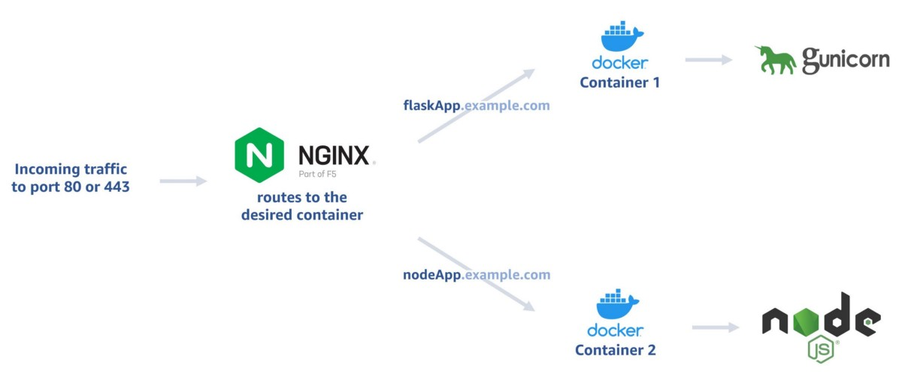

### How to Setup Nginx Reverse Proxy for Routing Incoming Traffic to Different Containers and Certbot for Auto-Renewing SSL Certificates

For small applications or test environments where separate machines for different web servers are cost prohibitive, one option is to have different servers run on the same machine in different Docker containers. Docker doesn’t support exposing the same port to multiple containers simultaneously ([source](https://github.com/docker/for-linux/issues/471)). Still, we can install Nginx on the host machine and have it conditionally route the requests to the different containers.

<figure>



<figcaption>

Incoming traffic routed to two docker containers with different web servers on the same machine

</figcaption>

</figure>

* * *

### The problem

After exposing port 80 to one container, if we try to have that port exposed to another container, we get the following error:

```shell
$ docker run -ti -d -p 80:80 httpd
docker: Error response from daemon: driver failed programming external connectivity on endpoint hopeful_haibt (...): Bind for 0.0.0.0:80 failed: port is already allocated.
```

### The solution: Reverse Proxy

In this example, we want to have one container to serve a Flask application for _flaskapp.example.com_ and another container to serve a Node.js application for _nodeapp.example.com_; both from port 80 of the same machine.

We will set up a reverse proxy that routes the request for hosts to different containers:

#### **1\. Install Docker**

There are plenty of tutorials out there for installing Docker, such as [this one](https://www.digitalocean.com/community/tutorials/how-to-install-and-use-docker-on-ubuntu-22-04). This article will focus on the routing part.

#### **2\. Install Nginx on the host machine**

Again, there are plenty of other good tutorials on this. [Here is one](https://www.digitalocean.com/community/tutorials/how-to-install-nginx-on-ubuntu-22-04). (You can also install Nginx in a separate container.)

#### **3\. Point your domains to the server**

For our example, we would setup A records for _flaskapp_ and _nodeapp_ that point to the IP of the server in the DNS records of _example.com_.

#### **4\. Run the Docker containers with the web servers you need, but on ports other than 80 and 443**

Say we have two Docker images already built or pulled: _flaskApp_ and _nodeApp_. We can expose port 8080 for _flaskApp_ and port 8081 for _nodeApp_:

```shell
$ docker run -dit -rm --name flaskApp -p 8080:80 my-flask-app
$ docker run -dit -rm --name nodeApp -p 8081:80 my-nodejs-app
```

At this point, you should be able to see your applications served at _flaskapp.example.com:8080_ and _nodeapp.example.com:8081._

#### **5\. Configure Nginx reverse proxy**

To serve both these apps on port 80, we will set up server blocks in the host machine.

Create the server block for _flaskapp.example.com_:

```shell
$ sudo nano /etc/nginx/sites-available/flaskapp.example.com
```

Paste the following in this file:

```json
server {
        listen 80;
        server_name flaskapp.example.com;
        location / {
                proxy_pass http://localhost:8080;
        }
}
```

Create the server block for _nodeapp.example.com_:

```shell
$ sudo nano /etc/nginx/sites-available/nodeapp.example.com
```

Paste the following in this file:

```json
server {
        listen 80;
        server_name nodeapp.example.com;
        location / {
                proxy_pass http://localhost:8080;
        }
}
```

Create symlinks in the sites-enabled directory:

```shell
$ sudo ln -s /etc/nginx/sites-available/flaskapp.example.com /etc/nginx/sites-enabled/
$ sudo ln -s /etc/nginx/sites-available/nodeapp.example.com /etc/nginx/sites-enabled/
```

Ensure that the configuration we did is valid:

```shell
$ sudo nginx -t
```

Restart Nginx:

```shell
$ sudo systemctl restart nginx
```

#### **6\. Setup automatically renewing SSL certificates with Certbot**

Install Certbot and its Nginx plugin.

```shell
$ sudo apt-get update
$ sudo apt-get install certbot
$ sudo apt-get install python3-certbot-nginx
```

Then generate certificates for your websites.

```shell
$ sudo certbot --nginx -d flaskapp.example.com -d www.flaskapp.example.com
$ sudo certbot --nginx -d nodeapp.example.com -d www.nodeapp.example.com
```

Now, if you look at the server blocks we’ve set up, you will see the new lines added for the SSL configuration automatically.

Of course, “-d www.flaskapp.example.com” is not necessary if you are not using the www version for the subdomain. After following the prompts, you will see a success message as below.

```json
Requesting a certificate for flaskapp.example.com

Successfully received certificate.
Certificate is saved at: /etc/letsencrypt/live/flaskapp.example.com/fullchain.pem
Key is saved at:
/etc/letsencrypt/live/flaskapp.example.com/privkey.pem
This certificate expires on 2022-10-25.
These files will be updated when the certificate renews.
Certbot has set up a scheduled task to automatically renew this certificate in the background.

Deploying certificate
Successfully deployed certificate for test4.cansin.net to /etc/nginx/sites-enabled/flaskapp.example.com
Congratulations! You have successfully enabled HTTPS on https://flaskapp.example.com
```

You can list your certificates with:

```shell
$ certbot certificates
```

… and delete them with:

```shell
$ sudo certbot delete --cert-name flaskapp.example.com
```

.. and delete the server blocks for that site:

```shell
$ sudo rm /etc/nginx/sites-enabled/flaskapp.example.com
$ sudo rm /etc/nginx/sites-available/flaskapp.example.com
```

* * *

#### Further reading:

1. I originally [published this post on Medium](https://medium.com/@cansinacarer/routing-docker-containers-with-different-web-servers-to-the-same-port-using-nginx-reverse-proxy-f28ada661357).
2. We’ve set this up in the host machine because it is not recommended to install Certbot inside the containers, as you can read more about it [here](https://eff-certbot.readthedocs.io/en/stable/install.html#running-with-docker).
3. [This article](https://iximiuz.com/en/posts/multiple-containers-same-port-reverse-proxy/) covers various methods of exposing multiple containers on the same port.
4. The accepted answer to [this question](https://www.digitalocean.com/community/questions/how-to-host-multiple-docker-containers-on-a-single-droplet-with-nginx-reverse-proxy) covers the same method described here.
5. [This page](https://www.nginx.com/blog/using-free-ssltls-certificates-from-lets-encrypt-with-nginx/) on Nginx website describes setting up certbot-nginx.
